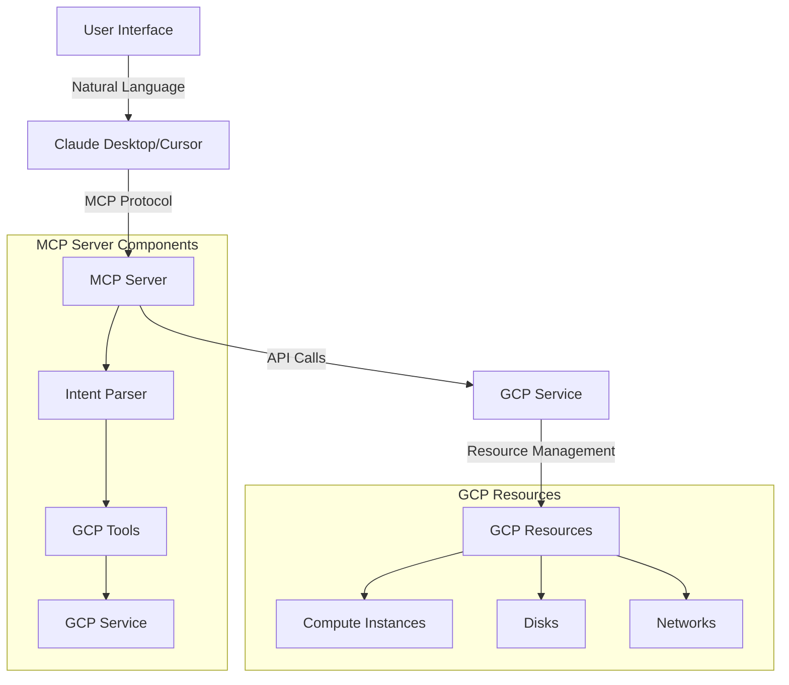
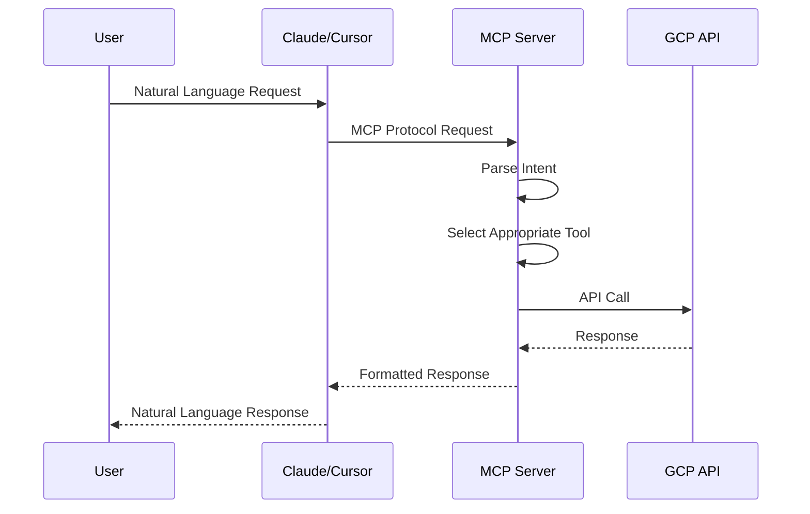

# MCP-GCP Integration Server

A powerful MCP (Machine Control Protocol) server that integrates with Google Cloud Platform (GCP) to provide seamless management of cloud resources through natural language interactions.

## Overview

This project implements an MCP server that bridges the gap between natural language processing and GCP resource management. It allows users to control and manage GCP resources through conversational interfaces like Claude Desktop and Cursor IDE.

## Features

### Instance Management
- **Create Instances**: Create new GCP instances with custom configurations
  - Machine type selection
  - Network interface configuration
  - Disk configuration
  - Labels and metadata
  - Source image selection

- **Modify Instances**: Comprehensive instance modification capabilities
  - Machine type changes
  - Network interface updates
  - Disk modifications
  - Label and metadata updates
  - Stop-edit-start workflow for major changes

- **Instance Operations**
  - Start instances
  - Stop instances
  - Restart instances
  - Delete instances
  - List instances
  - Get instance details

### Disk Management
- **Disk Operations**
  - Add new disks to instances
  - Modify existing disks (size, type)
  - Attach existing disks
  - Detach disks
  - Configure disk properties (auto-delete, mode)

### Network Management
- **Network Interface Configuration**
  - Configure network interfaces
  - Set up access configurations
  - Manage IP addresses

## Integration Guide

### Transport Types

The MCP server supports two transport types for communication:

1. **stdio (Standard Input/Output)**
   - Direct communication through standard input/output streams
   - Suitable for local development and testing
   - Lower latency
   - No network configuration required

2. **SSE (Server-Sent Events)**
   - HTTP-based communication
   - Suitable for production environments
   - Supports multiple clients
   - Better for web-based integrations

### Claude Desktop Integration

#### Using stdio Transport
1. Install Claude Desktop from [Anthropic's website](https://www.anthropic.com)
2. Configure Claude Desktop to use the MCP server with stdio:
   ```json
   {
     "mcpServers": {
       "mcp-gcp": {
         "command": "uv",
         "args": [
           "run main.py",
           "--transport",
           "stdio"
         ]
       }
     }
   }
   ```
3. Start the MCP server:
   ```bash
   uv run main.py --transport stdio
   ```

#### Using SSE Transport
1. Install Claude Desktop
2. Configure Claude Desktop to use the MCP server with SSE:
   ```json
   {
     "mcpServers": {
       "mcp-gcp": {
         "url": "http://localhost:8000/mcp",
         "transport": "sse"
       }
     }
   }
   ```
3. Start the MCP server:
   ```bash
   uv run main.py --transport sse --port 8000
   ```

### Cursor IDE Integration

#### Using stdio Transport
1. Install Cursor IDE from [Cursor's website](https://cursor.sh)
2. Configure Cursor to use the MCP server with stdio:
   ```json
   {
     "mcp": {
       "servers": {
         "mcp-gcp": {
           "command": "uv",
           "args": [
             "run main.py",
             "--transport",
             "stdio"
           ]
         }
       }
     }
   }
   ```
3. Start the MCP server:
   ```bash
   python src/server/mcpserver.py --transport stdio
   ```

#### Using SSE Transport
1. Install Cursor IDE
2. Configure Cursor to use the MCP server with SSE:
   ```json
   {
     "mcp": {
       "servers": {
         "mcp-gcp": {
           "url": "http://localhost:8000/mcp",
           "transport": "sse"
         }
       }
     }
   }
   ```
3. Start the MCP server:
   ```bash
   python src/server/mcpserver.py --transport sse --port 8000
   ```

## Architecture



## System Flow



## Getting Started

1. Clone the repository:
   ```bash
   git clone https://github.com/yourusername/mcp-gcp.git
   cd mcp-gcp
   ```

2. Install dependencies:
   ```bash
   uv install -r requirements.txt
   ```

3. Configure GCP credentials:
   ```bash
   export GOOGLE_APPLICATION_CREDENTIALS=/path/to/credentials.json
   export GCP_PROJECT_ID=your-project-id
   ```

4. Start the MCP server:
   ```bash
   uv run main.py
   ```

5. Configure your preferred interface (Claude Desktop or Cursor) to connect to the MCP server.

## Example Usage

### Instance Management
```bash
# Create a new instance
"Create a new instance named 'web-server' with 2 vCPUs and 4GB RAM"

# Modify an instance
"Change the machine type of 'web-server' to n2-standard-2"

# Manage disks
"Add a 100GB SSD disk to 'web-server'"
"Attach the existing disk 'data-disk-1' to 'web-server'"

# Instance operations
"Start the instance 'web-server'"
"Stop the instance 'web-server'"
"Delete the instance 'web-server'"
```

### Resource Monitoring
```bash
# List resources
"Show me all instances in asia-southeast1-b"
"List all disks attached to 'web-server'"

# Get details
"Show me the details of instance 'web-server'"
"What's the status of disk 'data-disk-1'?"
```

## Contributing

Contributions are welcome! Please feel free to submit a Pull Request.

## License

This project is licensed under the MIT License - see the LICENSE file for details.

